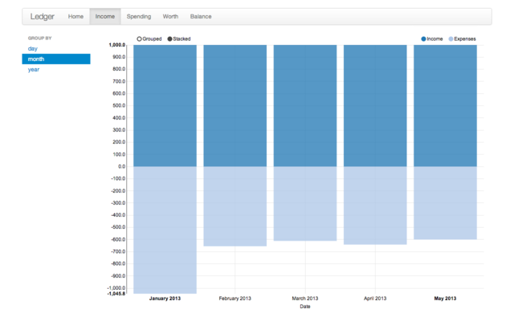
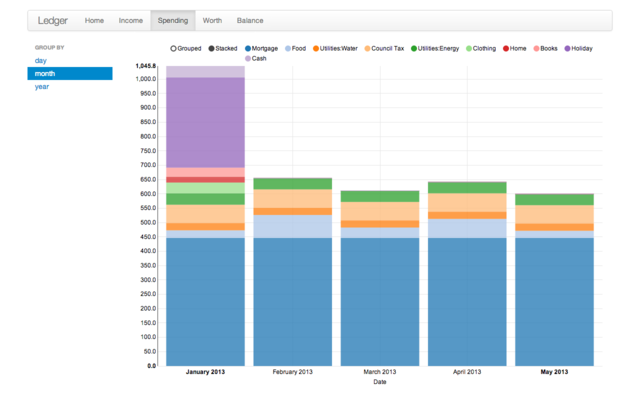
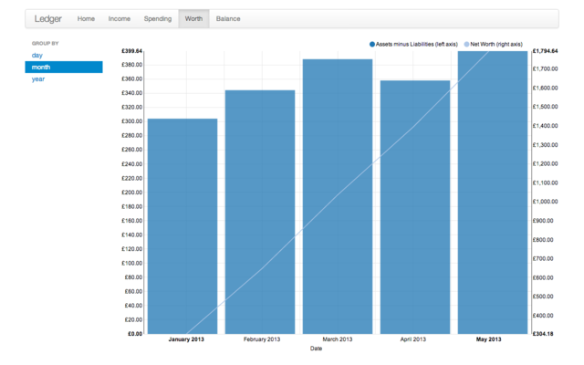
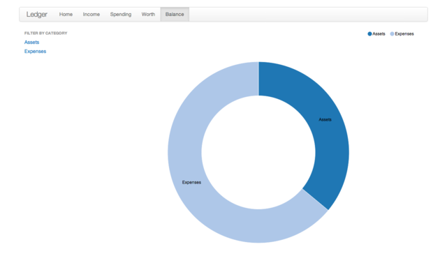

# ledger-web

Web front-end to access the Ledger command-line interface ([ledger-cli.org](http://ledger-cli.org/)).

> Ledger is a powerful, double-entry accounting system that is accessed from the UNIX command-line.

### Income

Income compared to expenditure over time (daily, monthly or yearly).

### Spending

Over time and grouped by expense (daily, monthly or yearly).

### Net Worth

Assets minus liabilities over time (daily, monthly or yearly).

### Balance

Breakdown of transactions, filterable by type.

## Dependencies

  * [Ledger 3](http://ledger-cli.org/)
  * [Node.js](nodejs.org) and npm

### Installing Ledger

The simplest way to install Ledger 3 is through [Homebrew](http://mxcl.github.com/homebrew/).

    brew install ledger --HEAD

The `--HEAD` option is required to install version 3.x.

## Usage

Clone the `node-ledger-web` git repository from GitHub.

    git clone https://github.com/slashdotdash/node-ledger-web.git

Install the dependencies with npm.

    cd node-ledger-web
    npm install
    
Bower is used for JavaScript and CSS assets, once installed `npm install -g bower`, you can download the required dependencies.

    bower install

Grunt is used for building the front-end assets, you need to run the default Grunt task, once installed `npm install -g grunt-cli`.
	
    grunt

Finally, run the express application and open [http://localhost:3000/](http://localhost:3000/) in a web browser. 

    NODE_ENV=production node app.js
    
By default it will start two http servers: one to listen on port 3000 for web requests; another on port 3001 for API requests.

### Configuration

The Ledger `.dat` file that is served is configured in the `app.js` file. Replace the `example.dat` file in the line shown below with your own Ledger accounting file.

    var ledgerRest = new LedgerRest({ file: 'example/example.dat' });